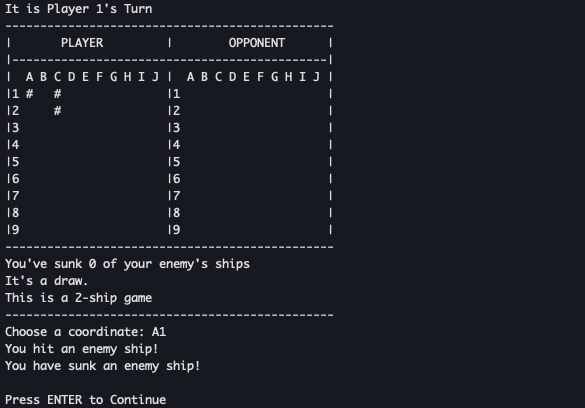
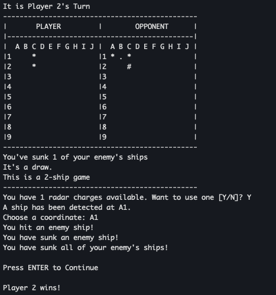

# Project 2: Battleship

## Group 5 - EECS 448

This program contains a two player battleship game written in C++.

## Welcome to Battleship:

The game allows players to choose the number of ships to play with (1-6), and
then asks each player where they would like to place their ships.

After all ships have been placed, players will take turns attacking their
opponents ships.

Attacks are sent by typing in the coordinate of the desired attack.

While playing the game, players will have the ability to view their own board as
well as the ability to view the attacks that they have sent on the opponents
board.

Once a player has sunk all of the other players ships, the game will end and the
program stops running.

## Deployment and Documentation

See the docs in the [documentation directory](./documentation/)
